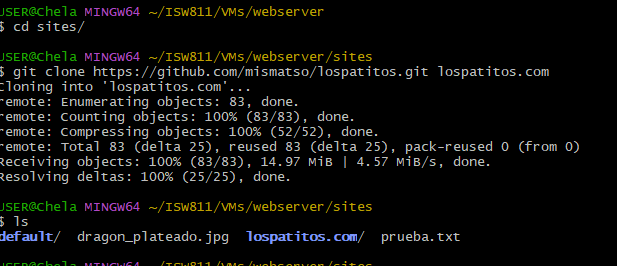
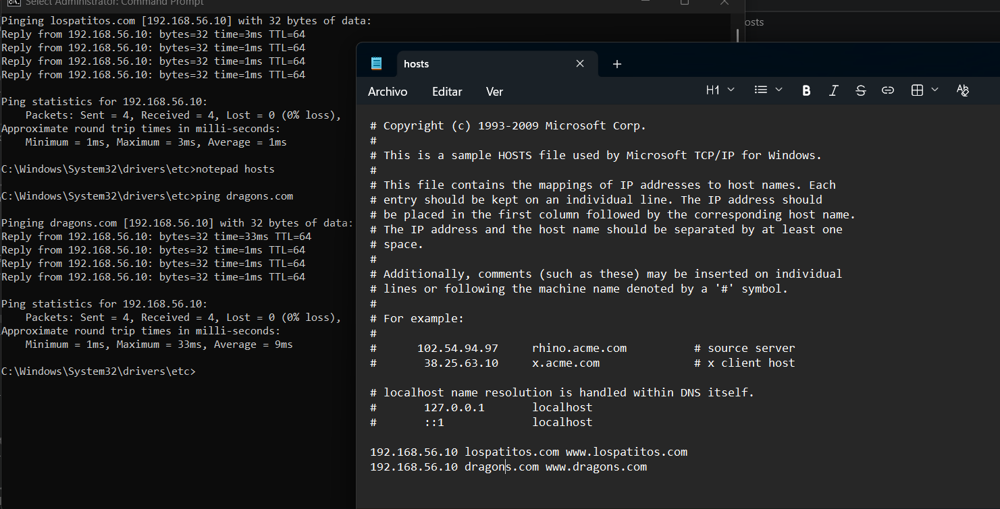

# Workshop 02 
##### RACHEL BARQUERO VARELA 

## Creación de directorios

- Crear los directorios de trabajo:

```bash5
mkdir Workshopss
mkdir Workshop02
```

## Inicialización del repositorio

- Inicializar Git y renombrar la rama principal:

```bash
git init
git branch -m main
```

## Configuración de Git

- Configurar nombre de usuario:

```bash
git config --global user.name "Rachel Barquero"
```

- Configurar correo electrónico:

```bash
git config --global user.email "barquerorei@gmail.com"
```

- Configurar Vim como editor:

```bash
git config --global core.editor vim
```

- Configurar Notepad++ como editor:

```bash
git config --global core.editor "\"C:\Program Files\Notepad++\notepad++.exe\" -multiInst -notabbar -nosession"
```


## Consultar configuración

- Ver configuración global:

```bash
git config --global --list
```

- Ver configuración local:

```bash
git config --list
```

## Comandos básicos de Git

- Verificar estado del repositorio:

```bash
git status
```

- Ver historial de commits:

```bash
git log
```

- Agregar archivos al área de preparación:

```bash
git add .
```

- Crear un commit:

```bash
git commit
```


- Se abrirá el editor configurado (Notepad++).

1. Escribir el asunto del commit (máximo 50 caracteres).
2. Opcionalmente agregar una descripción a partir de la tercera línea.
3. Guardar el archivo (`Ctrl + S`).
4. Cerrar el editor (`X`).

> **Nota:** Si el archivo no se guarda antes de cerrar el editor, Git cancelará el commit.

## Clonación del sitio de ejemplo

- Con el entorno preparado, se procedió a clonar el repositorio de ejemplo llamado lospatitos.


```cd sites
git clone https://github.com/ucenfotec/lospatitos.git lospatitos.com
``` 
Para verificar que la clonación fue exitosa se utilizó el siguiente comando:

```ls
```
Como resultado se observó la carpeta lospatitos.com.



## Configuración del archivo Hosts en windows

Se agregó la siguiente entrada al archivo `hosts`:

```text
192.168.56.10 lospatitos.com
```


## Verificación de funcionamiento

Validar la configuración de Apache:

```bash
sudo apache2ctl configtest

Resultado esperado:

Syntax OK

Reiniciar el servicio:

sudo systemctl restart apache2

Verificar el estado:

sudo systemctl status apache2

El servicio debe mostrarse como:

active (running)
```
## Acceso al sitio web

Como prueba final, se accedió al sitio desde el navegador:

```text
http://lospatitos.com
```

- El sitio cargó correctamente, confirmando que la configuración de Apache, PHP, el Virtual Host y la resolución de nombres funcionaban adecuadamente.


#### NOTA
## Compresión de archivos

- Comprimir el directorio:

```bash
tar cvfz Workshop02_Rachel.tar.gz Workshop02
```

- Descomprimir el archivo:

```bash
tar xvfz Workshop02_Rachel.tar.gz
```


